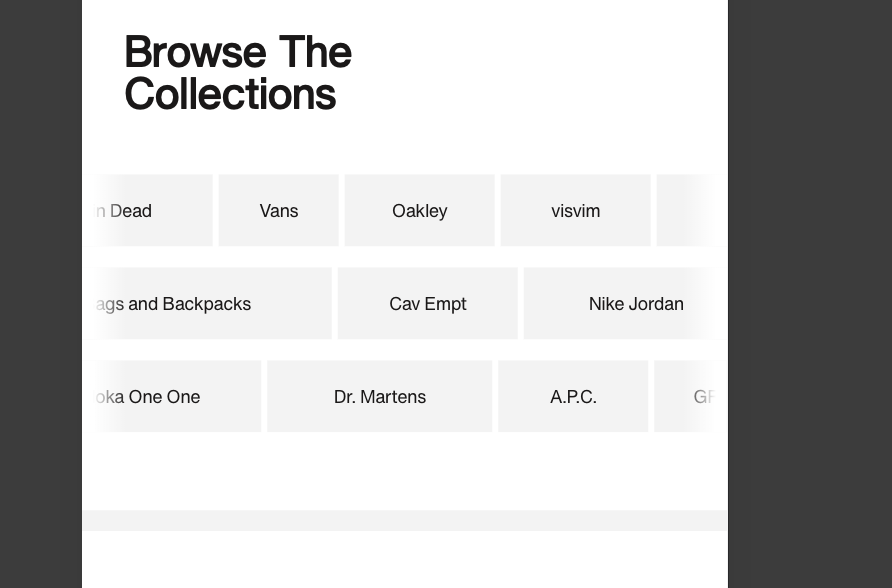

# Procesverslag
Markdown is een simpele manier om HTML te schrijven.  
Markdown cheat cheet: [Hulp bij het schrijven van Markdown](https://github.com/adam-p/markdown-here/wiki/Markdown-Cheatsheet).

Nb. De standaardstructuur en de spartaanse opmaak van de README.md zijn helemaal prima. Het gaat om de inhoud van je procesverslag. Besteedt de tijd voor pracht en praal aan je website.

Nb. Door *open* toe te voegen aan een *details* element kun je deze standaard open zetten. Fijn om dat steeds voor de relevante stuk(ken) te doen.

## Jij

  
uitwerken voor kick-off werkgroep

  ### Auteur:
  Eyso van Voorthuizen

  #### Je startniveau:
  blauw

  #### Je focus:
  surface plane
 

## Je website

  
uitwerken voor kick-off werkgroep

  ### Je opdracht:
  (https://nl.slamjam.com/)
  (https://nl.slamjam.com/products/our-legacy-clothing-full-zip-hood-brown-j296927?pr_prod_strat=e5_desc&pr_rec_id=99c7c0181&pr_rec_pid=8938811556045&pr_ref_pid=8932148347085&pr_seq=uniform)
  #### Screenshot(s) van de eerste pagina (small screen): 
  hier de naam van de pagina  
  

  #### Screenshot(s) van de tweede pagina (small screen):
  hier de naam van de pagina  
  
 

## Toegankelijkheidstest 1/2 (week 1)

  
uitwerken na test in 2e werkgroep

  ### Bevindingen
  Lijst met je bevindingen die in de test naar voren kwamen:

  - Veel images hebben geen of onduidelijk alt teksten.
  - Navigeren met de tab toets resulteerd in het openen van (waarschijnlijk) hidden content, en loop je uiteindelijk tegen een blokkade op.
  - Popup melding op de site heeft een heftige animatie, of eerder video, die misschien gevaarlijk kan zijn voor mensen met epilepsie.

  

## Voortgang 1 (week 2)

niet aanwezig geweest

## Voortgang 2 (week 3)

  
uitwerken voor 2e voortgang

  ### Stand van zaken
  Ik liep erg achter dus schouders eronder, + de site heeft een paar elementen met uitdagende code dus daarover advies gevraagd.

  ### Verslag van meeting
  - Veel met de lesopdrachten oefenen (grid, flexbox)
  - Zo veel mogelijk onderdelen van de site namaken
  - Volle aandacht geven door de opgelopen vertraging

## Toegankelijkheidstest 2/2 (week 4)

  
uitwerken na test in 9e werkgroep

  ### Bevindingen
  Lijst met je bevindingen die in de test naar voren kwamen (geef ook aan wat er verbeterd is):

  - Alle images hebben nu passende alt teksten, sommige communiceren ook aan mensen met bijv. slecht zicht waar ze in het proces op de website zitten zoals: "laatste productfoto"
  - Navigeren met Tab heeft nu een logisch hiërarchische volgorde
  - Wat nog beter kan is de duidleijkheid van knoppen, sommigen communiceren niet heel duidelijk dat ze klikbaar zijn.

## Voortgang 3 (week 4)

  
uitwerken voor 3e voortgang

  ### Stand van zaken
  Ik kreeg de stijl onder knie en kon ik goed toepassen alleen had ik nog moeite met de horizontale layout van de verschillende secties op de webpage.

  ### Agenda voor meeting
  - Hulp vragen over een onzichtbare padding
  - 

  ### Verslag van meeting
  hier na afloop snel de uitkomsten van de meeting vastleggen

  - grid in een grid niet optimaal --> flexbox gebruiken

## Eindgesprek (week 5)

  
uitwerken voor eindgesprek

  ### Je uitkomst - karakteristiek screenshots:
  

  ### Dit ging goed/Heb ik geleerd: 
  Leren werken met grid en het naar mijn mening goed kunnen nabootsen van de vormgeving van de website. Ook weet ik nu goed hoe ik horizontaal scrollbare secties moet maken

  

  ### Dit was lastig/Is niet gelukt:
  Een specifieke sectie op de webpage had een animatie waar drie lijsten van woorden in een oneindige loop horizontaal door het beeld bewogen. De bovenste en de onderste van links naar rechts en de middelste van rechts naar links. Uiteindelijk heb ik wel de vormgeving en het scrolle na kunnen maken maar is de loopanimatie me niet gelukt.

  

## Bronnenlijst

  
continu bijhouden terwijl je werkt

  Nb. Wees specifiek ('css-tricks' als bron is bijv. niet specifiek genoeg). 
  Nb. ChatGpT en andere AI horen er ook bij.
  Nb. Vermeld de bronnen ook in je code.

  1. ChatGPT Gesprekken
     - https://chatgpt.com/share/66f87266-cf30-800a-ab5a-9b37f6641f75
     - https://chatgpt.com/share/66f8728d-2cd0-800a-a5b8-710770fa0bf7
     - https://chatgpt.com/share/66f872bd-e288-800a-b1fc-a86608c8d2f4
     - https://chatgpt.com/share/6728d054-0a28-800a-a74f-5586a7223c35
  3. ( W3Schools online HTML editor. (z.d.). https://www.w3schools.com/tags/tryit.asp?filename=tryhtml_script_src
  4. (link hyperlinks) W3Schools.com. (z.d.). https://www.w3schools.com/html/html_links.asp
  5. Scrollbar verwijderen op horizontaal scrollbare secties
     - How do I remove the horizontal scrollbar in a div? (z.d.). Stack Overflow. https://stackoverflow.com/questions/4405954/how-do-i-remove-the-horizontal-scrollbar-in-a-div

